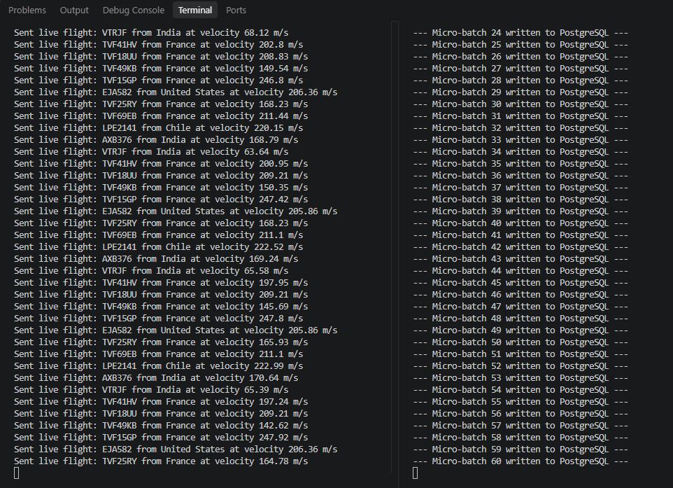
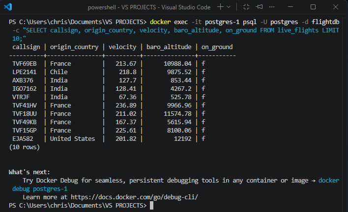
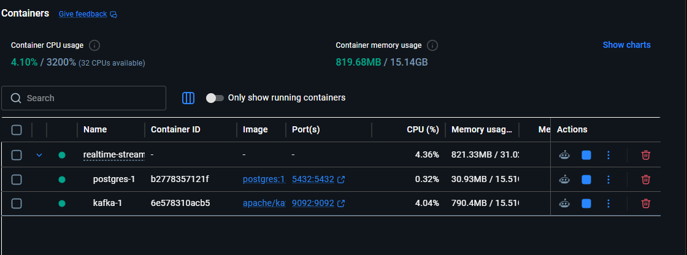

# Real-Time Streaming ELT Pipeline (Kafka + PySpark + PostgreSQL)

A production-ready real-time data engineering pipeline that ingests live flight telemetry data from a public API, streams it via Apache Kafka, processes it on-the-fly using Spark Structured Streaming, and loads structured records into a PostgreSQL data warehouse.

---

## 🏗️ Architecture & Data Flow
`[ OpenSky API ]` ---> `(Python Producer)` ---> `[ Apache Kafka ]` ---> `(PySpark Consumer)` ---> `[ PostgreSQL (Warehouse) ]`

* **Extract (E):** A Python-based producer continuously fetches live flight data from the OpenSky Network API and pushes JSON events to a Kafka topic.
* **Transform (T):** A PySpark Structured Streaming consumer reads the real-time stream, parses schemas, performs type casting, and structures the data in micro-batches.
* **Load (L):** The processed micro-batches are appended in real-time to a relational database table (`live_flights`) in PostgreSQL.

---

## 📸 Live Pipeline Demo

### 1. Real-Time Streaming Execution (Producer & Consumer)
The producer pushing messages to Kafka while Spark processes micro-batches in real-time.



### 2. Data Warehouse Output (PostgreSQL)
A sample query verifying that transformed data is successfully loaded into the target table.



### 3. Containerized Infrastructure (Docker Desktop)
All services running locally in isolated Docker containers ensuring reproducibility.



---

## 🛠️ Tech Stack
* **Language:** Python 3.10+
* **Messaging / Streaming Ingestion:** Apache Kafka, Zookeeper
* **Stream Processing:** Apache Spark (Structured Streaming / PySpark)
* **Storage / Sink:** PostgreSQL 15 (Relational Data Warehouse)
* **Orchestration & Deployment:** Docker & Docker Compose

---

## 📁 Repository Structure
```text
realtime-streaming-pipeline/
│
├── images/              # Screenshots for documentation
│   ├── terminal.png
│   ├── database.png
│   └── docker.png
│
├── docker-compose.yml    # Infrastructure orchestration (Kafka, Zookeeper, Postgres)
├── producer.py           # Ingestion script (API to Kafka)
├── consumer.py           # Spark streaming processing & DB sink
└── README.md             # Project documentation
